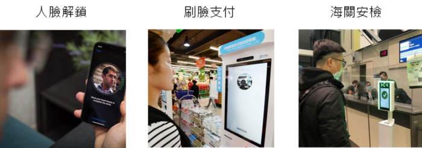
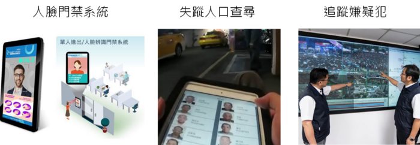
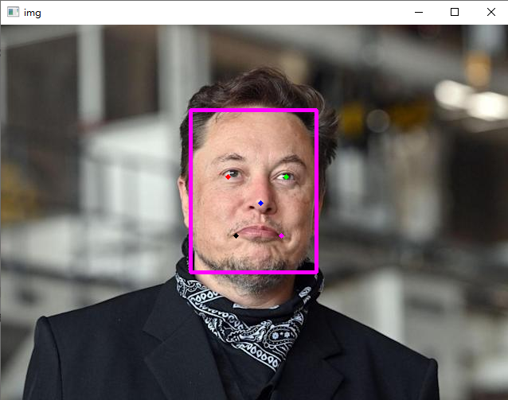

# Face Recognition in Python

使用 OpenCv 將影片導入影片，而影片是由很多張照片構成，搭配人臉辨識模組使用就可以在一段影片中找以存放在資料庫的人臉。

主要以此兩篇文章作為學習目標，並做出一定程度的修改。

1. [Face Recognition 人臉辨識 Python 教學. 人臉辨識在 Computer Vision… | by 李謦伊 | 謦伊的閱讀筆記 | Medium](https://medium.com/ching-i/face-recognition-%E4%BA%BA%E8%87%89%E8%BE%A8%E8%AD%98-python-%E6%95%99%E5%AD%B8-75a5e2ef534f)
2. [使用深度學習進行人臉辨識: Triplet loss, Large margin loss(ArcFace) | by 張銘 | Taiwan AI Academy | Medium](https://medium.com/ai-academy-taiwan/%E4%BD%BF%E7%94%A8%E6%B7%B1%E5%BA%A6%E5%AD%B8%E7%BF%92%E9%80%B2%E8%A1%8C%E4%BA%BA%E8%87%89%E8%BE%A8%E8%AD%98-8eef26596883)

主要區別:

- 結合兩者，添加相關知識、資料，並做出更詳細的註解(docstring and comment)
- 使用 Tkinter 做 GUI
- 優化檔案結構、模組化
- 除了辨識圖片外，也可以辨識影片中的人臉

## 目錄

- [Face Recognition in Python](#face-recognition-in-python)
  - [目錄](#目錄)
  - [環境及模組](#環境及模組)
    - [環境安裝](#環境安裝)
    - [下載辨識模型](#下載辨識模型)
- [Face Verification? Face Recognition?](#face-verification-face-recognition)
  - [Face Verification 人臉驗證](#face-verification-人臉驗證)
  - [Face Recognition 人臉辨識](#face-recognition-人臉辨識)
  - [Face Recognition 主要三部分](#face-recognition-主要三部分)
- [五大流程](#五大流程)
  - [Step 1. Face Detection](#step-1-face-detection)
  - [Step 2. Face Alignment](#step-2-face-alignment)
  - [Step 3. Feature extraction](#step-3-feature-extraction)
  - [Step 4. Create Database](#step-4-create-database)
  - [Step 5. Face Recognition](#step-5-face-recognition)
- [Face Recognition in Picture - DEMO](#face-recognition-in-picture---demo)
- [參考資料、網頁](#參考資料網頁)

## 環境及模組

- Python: 3.9
- IDE: Pycharm
- GUI: [Tkinter](https://docs.python.org/3/library/tk.html)
- Face detection package: [RetinaFace](https://github.com/heewinkim/retinafacee)
- Face recognition package: [DeepFace](https://github.com/serengil/deepface)
- Computer Vision Library: [OpenCV](https://opencv.org/)
- Database: sqlite
- Package Management: [pipenv](https://pypi.org/project/pipenv/)

### 環境安裝

```
$ pip install -r requirements.txt
```

或使用 pipenv

1. 安裝 pipenv

    ```bash
    $ pip install pipenv
    ```

2. 在專案目錄中創建一個新的虛擬環境，並使用 Python 3.9

    > 本機系統中必須有 Python 3.9，pipenv 才能找到並使用

    ```bash
    $ pipenv shell --python 3.9
    ```

    這會創建一個新的虛擬環境，並且將終端機/命令行界面設置到這個虛擬環境中。

3. 用 pipenv 安裝 requirements.txt 文件中的所有套件

    ```bash
    pipenv install -r requirements.txt
    ```


### 下載辨識模型

> 因檔案較大，請自行下載並放入 `./model` 資料夾中~也可以選擇其他模型

[arcface_r100_v1](https://github.com/SthPhoenix/InsightFace-REST)

# Face Verification? Face Recognition?

> Computer Vision 是一門研究機器如何「看」的科學

> 人臉驗證與人臉辨識的差別又為何呢?

### Face Verification 人臉驗證

- 確定一張臉是否為某人
- **`1 : 1`** matching problem
- 應用



### Face Recognition 人臉辨識

- 從擁有 k 個人物的 DataBase 確定一張臉的身分
- **`1 : k`**
- 應用



### Face Recognition 主要三部分

- **人臉偵測 Face Detection**

- **人臉對齊 Face Alignment**

- **特徵表徵 Feature Representation**

# 五大流程

1. Face Detection
2. Face Alignment
3. Feature extraction
4. Create Database
5. Face Recognition

## Step 1. Face Detection

> **偵測人臉並取得座標值**

使用 [**RetinaFace**](https://pypi.org/project/retinaface/) 進行人臉辨識

> 也可用 [MTCNN](https://pypi.org/project/mtcnn/)，不過 RetinaFace 的辨識表現略為優異。  
> 參考 → [RetinaFace: Single-stage Dense Face Localisation in the Wild](https://arxiv.org/pdf/1905.00641.pdf)


**CODE**

```python
import cv2
from retinaface import RetinaFace

# init with normal accuracy option
detector = RetinaFace(quality='normal')

# 讀取圖檔，因為 opencv 預設是 bgr 因此要轉成 rgb
img_path = 'database/Elon Musk/elon_musk_1.jpg'
img_bgr = cv2.imread(img_path, cv2.IMREAD_COLOR)
img_rgb = cv2.cvtColor(img_bgr, cv2.COLOR_BGR2RGB)

# 取得人臉及特徵的座標值 landmarks
detections = detector.predict(img_rgb)
print(detections)
print(len(detections))

# 將取得的座標值畫上記號及框框
img_result = detector.draw(img_rgb, detections)

# 轉回 cv2 可讀的 gbr
img = cv2.cvtColor(img_result, cv2.COLOR_RGB2BGR)

# show using cv2
cv2.imshow('img', img)
if cv2.waitKey(0) == ord('q'):  # press q to quit
    print('exit')

cv2.destroyWindow('img')
```

**output**

```python
[{'x1': 238, 'y1': 107, 'x2': 396, 'y2': 311, 'left_eye': (285, 191), 'right_eye': (358, 191), 
  'nose': (326, 224), 'left_lip': (295, 265), 'right_lip': (352, 265)}]
```



模組化以方便後續調用

```python
# in src/face_detection.py

def face_detect(img_path, detector):
    img_bgr = cv2.imread(img_path, cv2.IMREAD_COLOR)
    img_rgb = cv2.cvtColor(img_bgr, cv2.COLOR_BGR2RGB)
    detections = detector.predict(img_rgb)

    return img_rgb, detections


# 這個是辨識影片為求方便會用到的
def face_detect_bgr(img_bgr, detector):
    img_rgb = cv2.cvtColor(img_bgr, cv2.COLOR_BGR2RGB)
    detections = detector.predict(img_rgb)

    return img_rgb, detections

```

若出現錯誤可能是因為無法導入 shapely.geometry
模塊，因此需下載 [Shapely.package](https://www.lfd.uci.edu/~gohlke/pythonlibs/#shapely)
再執行以下指令導入

```bash
pip install <your Shapely package path>
```

## Step 2. Face Alignment

**將人臉對齊，也就是將傾斜的人臉轉至端正的角度。**

> 要將人臉對齊就得先定義對齊的座標 (**標準臉的座標**)。
> 參考 → [Inference Demo for ArcFace models](https://github.com/onnx/models/blob/master/vision/body_analysis/arcface/dependencies/arcface_inference.ipynb)

接著用 skimage 套件 transform.SimilarityTransform() 得到要變換的矩陣，利用仿射變換進行對齊。
參考 → [SKimage - transform.SimilarityTransform 相似變換 及其 人臉對齊的應用](https://www.796t.com/article.php?id=100363)

**CODE**

```python
import numpy as np
import cv2
from retinaface import RetinaFace
from skimage import transform as trans

detector = RetinaFace(quality='normal')  # init with normal accuracy option
img_path = 'database/Elon Musk/elon_musk_1.jpg'
img_rgb, detections = face_detect(img_path)
img_result = detector.draw(img_rgb, detections)
img = cv2.cvtColor(img_result, cv2.COLOR_RGB2BGR)

# 標準臉的 landmark points。許多網站都以此二維陣列作為標準臉關鍵點
src = np.array([
    [30.2946, 51.6963],
    [65.5318, 51.5014],
    [48.0252, 71.7366],
    [33.5493, 92.3655],
    [62.7299, 92.2041]], dtype=np.float32)

# 取得臉部特徵點座標 face_landmark points
face_landmarks = []
for i, face_info in enumerate(detections):
    face_landmarks = [face_info['left_eye'], face_info['right_eye'], face_info['nose'], face_info['left_lip'],
                      face_info['right_lip']]

# 將取得的 face_landmarks 作轉置 => 跟 src 矩陣一樣
dst = np.array(face_landmarks, dtype=np.float32).reshape(5, 2)

# 把 face_landmarks 跟 標準臉的 landmark points對齊
tform = trans.SimilarityTransform()  # 轉換矩陣 transformation matrix
tform.estimate(dst, src)  # 從一組對應點估計變換矩陣。 return True, if model estimation succeeds.
M = tform.params[0:2, :]  # 要用的轉換矩陣

# 仿射變換 affine transformation (原點變動，圖形及比例不變)
# cv2.warpAffine(輸入圖檔, 轉換矩陣, 輸出圖像大小, 邊界填充值)
aligned_rgb = cv2.warpAffine(img_rgb, M, (112, 112), borderValue=0)
aligned_bgr = cv2.cvtColor(aligned_rgb, cv2.COLOR_RGB2BGR)  # 轉回 bgr 才能用 opencv show 出來

# show using cv2
cv2.imshow('img', img)
cv2.imshow('aligned_bgr', aligned_bgr)
if cv2.waitKey(0) == ord('q'):  # press q to quit
    print('exit')

cv2.destroyWindow('aligned')
cv2.destroyWindow('img')
```

**對齊 landmark points 後的 Elon Musk**


模組化以方便後續調用

```python
# in src/face_alignment.py

import cv2
import numpy as np
from skimage import transform as trans


def face_align(img_rgb, landmarks):
    src = np.array([
        [30.2946, 51.6963],
        [65.5318, 51.5014],
        [48.0252, 71.7366],
        [33.5493, 92.3655],
        [62.7299, 92.2041]], dtype=np.float32)

    dst = np.array(landmarks, dtype=np.float32).reshape(5, 2)

    tform = trans.SimilarityTransform()
    tform.estimate(dst, src)

    M = tform.params[0:2, :]

    aligned = cv2.warpAffine(img_rgb, M, (112, 112), borderValue=0)

    return aligned

```

## Step 3. Feature extraction

> **提取人臉特徵 (landmark points)**

使用 **onnx ArcFace model** 進行提取。以下兩種都可用

- InsightFace-REST 模型 arcface_r100_v1 → [下載](https://github.com/SthPhoenix/InsightFace-REST)
- onnx 官方模型 → [下載](https://github.com/onnx/models/tree/master/vision/body_analysis/arcface)

這邊選擇前者，因為若使用 onnx 官方模型需要進行更新，而更新過程非常耗時(我自己的環境相差快五六分鐘)，
且更新後模型準確度較差。參考 → https://github.com/onnx/models/issues/156

需進行 **特徵標準化 Features Normalization**

> 為甚麼要特徵標準化 ? Ans : 提升預測準確度。更詳細前往 → [link](https://www.youtube.com/watch?v=1YpKUpitT98&t=199s)

**CODE**

```python
import onnxruntime as ort
from sklearn.preprocessing import normalize
import numpy as np
import cv2
from retinaface import RetinaFace
from skimage import transform as trans

detector = RetinaFace(quality='normal')  # init with normal accuracy option
img_path = 'database/Elon Musk/elon_musk_1.jpg'
img_rgb, detections = face_detect(img_path)

onnx_path = 'model/arcface_r100_v1.onnx'
EP_list = ['CPUExecutionProvider']

# Create inference session
sess = ort.InferenceSession(onnx_path, providers=EP_list)

# 取得臉部位置 positions 及特徵點座標 landmark points
face_positions = []
face_landmarks = []
for i, face_info in enumerate(detections):
    face_positions = [face_info['x1'], face_info['y1'], face_info['x2'], face_info['y2']]
    face_landmarks = [face_info['left_eye'], face_info['right_eye'], face_info['nose'], face_info['left_lip'],
                      face_info['right_lip']]

# 取得對齊後的圖片並作轉置
aligned = face_align(img_rgb, face_landmarks)
t_aligned = np.transpose(aligned, (2, 0, 1))

# 將轉置後的人臉轉換 dtype 為 float32，並擴充矩陣維度，因為後續函式需要二維矩陣
inputs = t_aligned.astype(np.float32)
input_blob = np.expand_dims(inputs, axis=0)

# get the outputs metadata and inputs metadata
first_input_name = sess.get_inputs()[0].name
first_output_name = sess.get_outputs()[0].name

# inference run using image_data as the input to the model
# pass a tuple rather than a single numpy ndarray.
prediction = sess.run([first_output_name], {first_input_name: input_blob})[0]

# 進行正規化並且轉成一維陣列
final_embedding = normalize(prediction).flatten()
```

模組化以方便後續調用

```python
# in src/feature_extraction.py

import numpy as np
from face_alignment import face_align
from sklearn.preprocessing import normalize


def feature_extract(img_rgb, detections, sess):
    positions = []
    landmarks = []
    embeddings = np.zeros((len(detections), 512))
    for i, face_info in enumerate(detections):
        face_position = [face_info['x1'], face_info['y1'], face_info['x2'], face_info['y2']]
        face_landmarks = [face_info['left_eye'], face_info['right_eye'],
                          face_info['nose'], face_info['left_lip'], face_info['right_lip']]

        positions.append(face_position)
        landmarks.append(face_landmarks)

        aligned = face_align(img_rgb, face_landmarks)
        t_aligned = np.transpose(aligned, (2, 0, 1))

        inputs = t_aligned.astype(np.float32)
        input_blob = np.expand_dims(inputs, axis=0)

        first_input_name = sess.get_inputs()[0].name
        first_output_name = sess.get_outputs()[0].name

        prediction = sess.run([first_output_name], {first_input_name: input_blob})[0]
        final_embedding = normalize(prediction).flatten()

        embeddings[i] = final_embedding

    return positions, landmarks, embeddings
```

補充 : [Deep Learning Training vs. Inference - Official NVDIA Blog](https://blogs.nvidia.com/blog/2016/08/22/difference-deep-learning-training-inference-ai/)

> After training is completed, the networks are deployed into the field for “inference” — classifying data to “infer” a result

## Step 4. Create Database

> **創建資料庫並放入照片以供我們後續進行比對**

使用 `sqlite3` 及管理工具 DB Browser for sqlite
參考 → [SQLite-Python](https://www.runoob.com/sqlite/sqlite-python.html)、[DB Browser 簡單介紹](https://www.minwt.com/website/server/21758.html)

sqlite3 中無法直接用 blob 數據存取 numpy 數組因此需要 `adapter` 及 `converter`
參考 → [Python insert numpy array into sqlite3 database - Stack Overflow](https://stackoverflow.com/questions/18621513/python-insert-numpy-array-into-sqlite3-database%E3%80%82)

**CODE**

```python
import sqlite3
import io
import os
import numpy as np


def adapt_array(arr):
    out = io.BytesIO()
    np.save(out, arr)
    out.seek(0)
    return sqlite3.Binary(out.read())


def convert_array(text):
    out = io.BytesIO(text)
    out.seek(0)
    return np.load(out)


# 將 file_path 底下的資料全部存進 file_data (list)
def load_file(file_path):
    file_data = {}
    for person_name in os.listdir(file_path):
        person_file = os.path.join(file_path, person_name)

        total_pictures = []
        for picture in os.listdir(person_file):
            picture_path = os.path.join(person_file, picture)
            total_pictures.append(picture_path)

        file_data[person_name] = total_pictures

    return file_data


# converts np.array to TEXT when inserting
sqlite3.register_adapter(np.ndarray, adapt_array)

# converts TEXT to np.array when selecting
sqlite3.register_converter("ARRAY", convert_array)

# 連接到 SQLite 數據庫。 若文件不存在則會自動創建
conn_db = sqlite3.connect('database/database.db')

# 創建表
conn_db.execute('CREATE TABLE face_info \
            (ID INT PRIMARY KEY NOT NULL, \
            NAME TEXT NOT NULL, \
            Embedding ARRAY NOT NULL)')

# 將 database 載入數據庫
file_path = 'database'
if os.path.exists(file_path):
    file_data = load_file(file_path)

    for i, person_name in enumerate(file_data.keys()):
        picture_path = file_data[person_name]
        sum_embeddings = np.zeros([1, 512])

        # 將所有同對象的圖片的臉部特徵值加總
        for j, picture in enumerate(picture_path):
            img_rgb, detections = face_detect(picture)
            position, landmarks, embeddings = feature_extraction(img_rgb, detections)
            sum_embeddings += embeddings

        final_embedding = sum_embeddings / len(picture_path)  # 平均值
        adapt_embedding = adapt_array(final_embedding)

        # 插入值
        conn_db.execute("INSERT INTO face_info (ID, NAME, Embeddings) VALUES (?, ?, ?)",
                        (i, person_name, adapt_embedding))
    conn_db.commit()
    conn_db.close()
```

模組化以方便後續調用

```python
# in src/database.py

import sqlite3
import os
import numpy as np
import io
from face_detection import face_detect
from feature_extraction import feature_extract


def adapt_array(arr):
    out = io.BytesIO()
    np.save(out, arr)
    out.seek(0)

    return sqlite3.Binary(out.read())


def convert_array(text):

    out = io.BytesIO(text)
    out.seek(0)
    return np.load(out)


def load_file(file_path):
    file_data = {}
    for person_name in os.listdir(file_path):
        person_dir = os.path.join(file_path, person_name)

        person_pictures = []
        for picture in os.listdir(person_dir):
            picture_path = os.path.join(person_dir, picture)
            person_pictures.append(picture_path)

        file_data[person_name] = person_pictures

    return file_data


def create_db(db_path, file_path, detector, sess):
    if os.path.exists(file_path):
        conn_db = sqlite3.connect(db_path)
        conn_db.execute("CREATE TABLE face_info \
                            (ID INT PRIMARY KEY NOT NULL, \
                             NAME TEXT NOT NULL, \
                            Embeddings ARRAY NOT NULL)")
        file_data = load_file(file_path)
        for i, person_name in enumerate(file_data.keys()):
            picture_path = file_data[person_name]
            sum_embeddings = np.zeros([1, 512])
            for j, picture in enumerate(picture_path):
                img_rgb, detections = face_detect(picture, detector)
                position, landmarks, embeddings = feature_extract(img_rgb, detections, sess)
                sum_embeddings += embeddings

            final_embedding = sum_embeddings / len(picture_path)
            adapt_embedding = adapt_array(final_embedding)

            conn_db.execute("INSERT INTO face_info (ID, NAME, Embeddings) VALUES (?, ?, ?)",
                            (i, person_name, adapt_embedding))
        conn_db.commit()
        conn_db.close()
    else:
        print('database path does not exist')

```

## Step 5. Face Recognition

> **將輸入的照片與資料庫中的照片進行比對**

使用 **L2-Norm** 計算之間 **最佳的距離 (distance)**，可視為兩張人臉之 **差異程度**。
可以參考 → [理解 L1，L2 範數在機器學習中應用](https://www.twblogs.net/a/5c80a66abd9eee35cd693c3e)

給定 `threshold`，若 distance > threshold ⇒ 不同人臉，反之則視為同一張臉

比對照片找出最相似的人並判斷差異是否低於門檻

```python
import numpy as np
import sqlite3
import io
import os

# 連接資料庫並取得內部所有資料
conn_db = sqlite3.connect('database/database.db')
cursor = conn_db.cursor()
db_data = cursor.fetchall()

# 跟 database 中的數據做比較
total_distances = []
total_names = []
for data in db_data:
    total_names.append(db_data[1])
    db_embeddings = convert_array(data[2])
    distance = round(np.linalg.norm(db_embeddings - embeddings), 2)
    total_distances.append(distance)

# 所有人比對的結果
total_resul = dict(zip(total_names, total_distances))

# 找到距離最小者，也就是最像的人臉
idx_min = np.argmin(total_distances)

# 最小距離者的名字與距離
name, distance = total_names[idx_min], total_distances[idx_min]

# set threshold
threshold = 1

# 差異是否低於門檻
if distance < threshold:
    print('Found!', name, distance, total_result)
else:
    print('Unknown person', name, distance, total_result)
```

做成 function 以便調用

```python
def compare_face(embeddings, threshold):
    conn_db = sqlite3.connect('database.db')
    cursor = conn_db.cursor()
    db_data = cursor.fetchall()

    total_distances = []
    total_names = []
    for data in db_data:
        total_names.append(data[1])
        db_embeddings = convert_array(db_data[2])
        distance = round(np.linalg.norm(db_embeddings - embeddings), 2)
        total_distances.append(distance)

    total_result = dict(zip(total_names, total_distances))
    idx_min = np.argmin(total_distances)

    name, distance = total_names[idx_min], total_distances[idx_min]

    if distance > threshold:
        name = 'Unknown person'

    return name, distance, total_result
```

# Face Recognition in Picture - DEMO


```python
total_result: {'Elon Musk': 1.49, 'Mark Zuckerberg': 0.6, 'Steve Jobs': 1.38}
total_result: {'Elon Musk': 0.73, 'Mark Zuckerberg': 1.48, 'Steve Jobs': 1.39}
total_result: {'Elon Musk': 1.33, 'Mark Zuckerberg': 1.43, 'Steve Jobs': 1.28}
total_result: {'Elon Musk': 1.49, 'Mark Zuckerberg': 1.49, 'Steve Jobs': 0.95}
```

# 參考資料、網頁

1. 主要參考
   1. [Face Recognition 人臉辨識 Python 教學. 人臉辨識在 Computer Vision… | by 李謦伊 | 謦伊的閱讀筆記 | Medium](https://medium.com/ching-i/face-recognition-%E4%BA%BA%E8%87%89%E8%BE%A8%E8%AD%98-python-%E6%95%99%E5%AD%B8-75a5e2ef534f)
   2. [使用深度學習進行人臉辨識: Triplet loss, Large margin loss(ArcFace) | by 張銘 | Taiwan AI Academy | Medium](https://medium.com/ai-academy-taiwan/%E4%BD%BF%E7%94%A8%E6%B7%B1%E5%BA%A6%E5%AD%B8%E7%BF%92%E9%80%B2%E8%A1%8C%E4%BA%BA%E8%87%89%E8%BE%A8%E8%AD%98-8eef26596883)
2. Face Detection
   1. retinaface : [retinaface · PyPI](https://pypi.org/project/retinaface/)
   2. RetinaFace paper : [1905.00641.pdf (arxiv.org)](https://arxiv.org/pdf/1905.00641.pdf)
   3. ArcFace
      論文詳解 : [人臉識別：《Arcface》論文詳解，對損失層的改進有較為詳細的講解 人臉識別：《Arcface》論文詳解 - IT 閱讀 (itread01.com)](https://www.itread01.com/content/1544950508.html)
3. Face Alignment
   1. [Face Alignment with OpenCV and Python (68 points)](https://www.pyimagesearch.com/2017/05/22/face-alignment-with-opencv-and-python/)
   2. Skimage : [SKimage - transform.SimilarityTransform 相似變換 及其 人臉對齊的應用*實用技巧*程式人生 (796t.com)](https://www.796t.com/article.php?id=100363)
   3. cv2.WarpAffine : [opencv warpAffine()函数详解 -- 图像旋转与平移\_高祥 xiang 的博客-CSDN 博客\_warpaffine 函数](https://blog.csdn.net/qq_27278957/article/details/88865777)
   4. Numpy API Reference : [NumPy Reference — NumPy v1.21 Manual](https://numpy.org/doc/stable/reference/index.html)
4. Face Extraction
   1. Deep Learning Training?
      Inference? : [What’s the Difference Between Deep Learning Training and Inference? - The Official NVIDIA Blog](https://blogs.nvidia.com/blog/2016/08/22/difference-deep-learning-training-inference-ai/)
   2. Normalization : [sklearn.preprocessing 之資料預處理 | 程式前沿 (codertw.com)](https://codertw.com/%E7%A8%8B%E5%BC%8F%E8%AA%9E%E8%A8%80/462533/#outline__4)
   3. sklearn.preprocessing.normalize
      API : [sklearn.preprocessing.normalize — scikit-learn 1.0.2 documentation](https://scikit-learn.org/stable/modules/generated/sklearn.preprocessing.normalize.html)
   4. 為甚麼要特徵標準化 : [为什么要特征标准化 (深度学习)? Why need the feature normalization (deep learning)? - YouTube](https://www.youtube.com/watch?v=1YpKUpitT98&t=199s)
5. Create Database - using SQLite
   1. [SQLite 是什麼？ - SQLite 教學 (gitbook.net)](http://tw.gitbook.net/sqlite/sqlite_overview.html)
   2. [DB Browser for SQLite 視覺化的 SQLite 管理工具，新增、瀏覽資料超方便 | 梅問題．教學網 (minwt.com)](https://www.minwt.com/website/server/21758.html)
   3. [python 操作 sqlite 數據庫的方法 – WalkonNet](https://walkonnet.com/archives/298492)
   4. [python 中 sqllite 插入 numpy 數組到數據庫的實現方法 – WalkonNet](https://walkonnet.com/archives/289824)
   5. [Python insert numpy array into sqlite3 database - Stack Overflow](https://stackoverflow.com/questions/18621513/python-insert-numpy-array-into-sqlite3-database%E3%80%82)
6. Face Recongition
   1. [理解 L1，L2 範數在機器學習中應用 - 台部落 (twblogs.net)](https://www.twblogs.net/a/5c80a66abd9eee35cd693c3e)
7. OpenCV
   1. [【python】opencv 2 小時初學者教學 ｜ 影像辨識 ｜ 影像處理 ｜ 人臉辨識 ｜ 電腦視覺 - YouTube](https://www.youtube.com/watch?v=xjrykYpaBBM&list=PLRjgE3pAnTILu-OfvYYFpDD4vl0v6kZgT&index=12)
8. onnx
   1. [models/arcface_inference.ipynb at master · onnx/models (github.com)](https://github.com/onnx/models/blob/master/vision/body_analysis/arcface/dependencies/arcface_inference.ipynb)
   2. [ONNX models | Microsoft Docs](https://docs.microsoft.com/en-us/windows/ai/windows-ml/get-onnx-model)
9. 其他
   1. [莫烦 Python (mofanpy.com)](https://mofanpy.com/)
   2. [刑事政策與犯罪研究論文集-22-09-王正嘉-ai-與人臉辨識技術運用於犯罪偵防之問題分析.pdf (moj.gov.tw)](https://www.cprc.moj.gov.tw/media/11722/%E5%88%91%E4%BA%8B%E6%94%BF%E7%AD%96%E8%88%87%E7%8A%AF%E7%BD%AA%E7%A0%94%E7%A9%B6%E8%AB%96%E6%96%87%E9%9B%86-22-09-%E7%8E%8B%E6%AD%A3%E5%98%89-ai-%E8%88%87%E4%BA%BA%E8%87%89%E8%BE%A8%E8%AD%98%E6%8A%80%E8%A1%93%E9%81%8B%E7%94%A8%E6%96%BC%E7%8A%AF%E7%BD%AA%E5%81%B5%E9%98%B2%E4%B9%8B%E5%95%8F%E9%A1%8C%E5%88%86%E6%9E%90.pdf?mediaDL=true)
   3. [一次了解人臉辨識的各種應用【2022 最新版】 (cyberlink.com)](https://tw.cyberlink.com/faceme/insights/articles/236/how_is_facial_recognition_used_in_2021)
